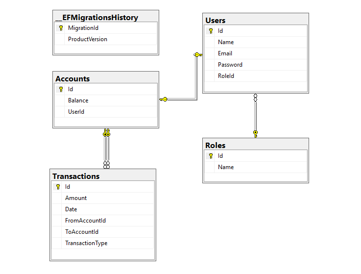

# Documentación del Modelo de Datos — DigitalArs

**Etapa 1 — Revisión técnica**  
Proyecto: Billetera Virtual  
Tecnología: .NET 10 · Entity Framework Core 10 · SQL Server

---

## 1. Diagrama Entidad-Relación



---

## 2. Entidades y atributos

### Roles

Catálogo de roles del sistema. Define el nivel de acceso de cada usuario.

| Columna | Tipo         | Restricciones |
| ------- | ------------ | ------------- |
| Id      | int          | PK, IDENTITY  |
| Name    | nvarchar(50) | NOT NULL      |

---

### Users

Representa a cada persona registrada en la plataforma.

| Columna  | Tipo          | Restricciones            |
| -------- | ------------- | ------------------------ |
| Id       | int           | PK, IDENTITY             |
| Name     | nvarchar(100) | NOT NULL                 |
| Email    | nvarchar(256) | NOT NULL, UNIQUE         |
| Password | nvarchar(256) | NOT NULL                 |
| RoleId   | int           | FK → Roles(Id), NOT NULL |

---

### Accounts

Billetera virtual de cada usuario. Almacena el saldo actual y actúa como nodo central de todas las transacciones.

| Columna | Tipo          | Restricciones                    |
| ------- | ------------- | -------------------------------- |
| Id      | int           | PK, IDENTITY                     |
| Balance | decimal(18,2) | NOT NULL, DEFAULT 0              |
| UserId  | int           | FK → Users(Id), NOT NULL, UNIQUE |

---

### Transactions

Registra cada movimiento de dinero del sistema: depósitos y transferencias entre cuentas.

| Columna         | Tipo          | Restricciones               |
| --------------- | ------------- | --------------------------- |
| Id              | int           | PK, IDENTITY                |
| Amount          | decimal(18,2) | NOT NULL                    |
| Date            | datetime2     | NOT NULL                    |
| FromAccountId   | int           | FK → Accounts(Id), NOT NULL |
| ToAccountId     | int           | FK → Accounts(Id), NOT NULL |
| TransactionType | nvarchar(20)  | NOT NULL                    |

**Valores posibles de TransactionType:** `Deposit`, `TransferIn`, `TransferOut`  
Se almacena como string para que la base de datos sea legible sin necesidad de tablas de referencia.

---

## 3. Relaciones

| Relación                        | Tipo  | Descripción                                                                             |
| ------------------------------- | ----- | --------------------------------------------------------------------------------------- |
| Role → User                     | 1 : N | Un rol puede ser asignado a muchos usuarios. Un usuario tiene exactamente un rol.       |
| User → Account                  | 1 : 1 | Cada usuario posee exactamente una billetera. La FK vive en Accounts (UserId).          |
| Account → Transaction (origen)  | 1 : N | Una cuenta puede ser origen de muchas transacciones (TransactionsFrom / FromAccountId). |
| Account → Transaction (destino) | 1 : N | Una cuenta puede ser destino de muchas transacciones (TransactionsTo / ToAccountId).    |

---

## 4. Justificación de índices

### IX_Users_Email (UNIQUE)

```sql
CREATE UNIQUE INDEX [IX_Users_Email] ON [Users] ([Email]);
```

**Por qué:** el login busca al usuario por email. Sin índice, cada autenticación haría un full scan de la tabla `Users`. El índice único además garantiza a nivel de base de datos que no puedan existir dos cuentas con el mismo correo, complementando la validación de la capa de aplicación con una restricción real en el motor.

---

### IX_Accounts_UserId (UNIQUE)

```sql
CREATE UNIQUE INDEX [IX_Accounts_UserId] ON [Accounts] ([UserId]);
```

**Por qué:** la consulta más frecuente de la billetera es "dame la cuenta de este usuario". Sin índice es un full scan de `Accounts`. El índice único refuerza además la restricción 1:1 entre `User` y `Account` a nivel de motor, evitando que un bug en la capa de aplicación cree dos cuentas para el mismo usuario.

---

### IX_Transactions_Date

```sql
CREATE INDEX [IX_Transactions_Date] ON [Transactions] ([Date]);
```

**Por qué:** el historial de movimientos siempre se consulta y ordena por fecha (ej. "últimos 30 días", "movimientos de este mes"). Sin este índice, cualquier consulta con `WHERE Date >= ...` u `ORDER BY Date` requeriría un full scan de `Transactions`, que es la tabla que más crece en el tiempo y donde el impacto sería mayor.

---

### IX_Transactions_FromAccountId / IX_Transactions_ToAccountId

```sql
CREATE INDEX [IX_Transactions_FromAccountId] ON [Transactions] ([FromAccountId]);
CREATE INDEX [IX_Transactions_ToAccountId]   ON [Transactions] ([ToAccountId]);
```

**Por qué:** generados automáticamente por EF Core para las claves foráneas. Aceleran las consultas de "todas las transacciones enviadas/recibidas por esta cuenta" y son necesarios para que los JOINs con `Accounts` sean eficientes.

---

## 5. Decisiones de modelado

### decimal(18,2) para montos

`float` y `double` tienen errores de representación en punto flotante que son inaceptables para dinero (ej. 0.1 + 0.2 ≠ 0.3). `decimal(18,2)` garantiza precisión exacta con hasta 16 dígitos enteros y 2 decimales, suficiente para cualquier monto en pesos o dólares.

---

### datetime2 para fechas

`datetime2` tiene mayor rango y precisión que `datetime` en SQL Server, y es el tipo recomendado por Microsoft para columnas de fecha/hora en bases de datos nuevas. Permite precisión de hasta 100 nanosegundos, importante para ordenar transacciones que ocurren en el mismo segundo.

---

### TransactionType como string (nvarchar)

Guardar el enum como string en lugar de int hace la base de datos autoexplicativa: al hacer una consulta directa se ve `TransferOut` en lugar de `2`. Facilita el debugging, los reportes directos en SQL y reduce la necesidad de documentación adicional para el equipo de datos.

---

### Borrado en cascada deshabilitado (ON DELETE NO ACTION)

`Transactions` tiene dos claves foráneas apuntando a `Accounts` (`FromAccountId` y `ToAccountId`). Si ambas tuviesen `CASCADE`, SQL Server lanzaría un error de múltiples rutas de cascada hacia la misma tabla. Se eligió `RESTRICT` en todas las relaciones por dos razones:

1. **Técnica:** evita el error de SQL Server con múltiples paths de cascada.
2. **De negocio:** en una billetera virtual nunca se eliminan usuarios, cuentas ni transacciones. El borrado lógico (soft delete) es la práctica correcta para mantener trazabilidad e integridad del historial financiero.

---

### FK de la relación 1:1 en Accounts (no en Users)

La clave foránea `UserId` vive en `Accounts` y no en `Users`. Esto permite que `Users` exista sin necesitar una cuenta creada de antemano (útil en un flujo de registro en dos pasos), y evita una referencia circular entre las dos tablas.

---

## 6. Configuración de la capa de acceso a datos

El esquema fue generado mediante EF Core Code-First. Cada entidad tiene su clase `IEntityTypeConfiguration<T>` en `DigitalArs.Infrastructure/Data/Configurations/`, registradas automáticamente en `AppDbContext.OnModelCreating` con `ApplyConfigurationsFromAssembly`.

El acceso a datos se realiza exclusivamente a través del patrón **Repository + Unit of Work** (`IRepository<T>` / `IUnitOfWork`) definido en `DigitalArs.Domain/Interfaces/`, manteniendo la capa de aplicación desacoplada de EF Core.
